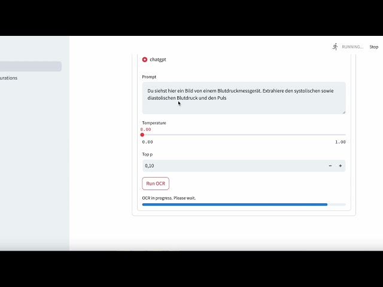

# AI-Optical-Character-Recognition (AI-OCR) Frontend: Extracting data from images

During my undergrad and postgrad Physics labs, I often had to manually read measurements from instruments, jot them down on paper, transfer them to a spreadsheet, and then generate plots—an inefficient and tedious process. Since I work in GenAI now after leaving Academia, I realized: Wait a minute... this can be automated! AI-OCR does exactly that. Simply take pictures of your measurements (or upload PDFs containing standardized numerical data, like financial reports), specify what numbers to extract, and let the AI generate insightful plots.

This tool also helps break free from proprietary software silos in Academia, where measurement data is often locked into vendor-specific formats. To showcase its capabilities, I attached a demo video below where I measured my blood pressure throughout the day, uploaded the images, and effortlessly plotted the results. It can even be applied to financial reports. I’ve used it on my business accounting PDFs to generate histograms of stock buy-in values—showing how AI-OCR can unlock valuable insights from structured financial data.

This repository is the frontend code for a tool with which you can extract data from images using visual LLMs.
The backend code (using fastapi) can be found here: [AI-OCR](https://github.com/jWinman91/AI-OCR).

## Table of Contents

- [Installation](#Installation)
- [Usage](#Usage)
- [Example](#Example)
- [License](#license)


## Installation

To use the AI-OCR tool, it is best if you install both repositories, backend and frontend, i.e. follow these steps:
1. Clone this repository for the backend
```bash
git clone https://github.com/jWinman91/AI-OCR.git
cd ai-ocr
```
2. Install the required dependencies for the backend:
```bash
pip install -r requirements.txt
```
On Linux or MacOS you can also simply run the install.sh script:
```bash
chmod +x install.sh && ./install.sh
```
3. Clone the frontend repository
```bash
git clone https://github.com/jWinman91/AI-OCR-Frontend.git
cd ai-ocr-frondend
```
3. Install the required dependencies for the frontend:
```bash
pip install -r requirements.txt
```

## Usage

You can then start the backend by running:
```bash
python app.py $IP_ADDRESS
```

Since, the backend uses fastapi, you could now try it out via the fastapi docs by going to ```$IP_ADDRESS:5000/docs```.

But you can also start the frontend now by running:
``` bash
chmod +x start_up.sh
./start_up.sh
```
from within the cloned frontend repository.

A streamlit window will automaticall open in your browser.
Within the web application you'll then find two pages on the sidebar:
* AI-OCR: Webpage for running the actual optical character recognition
* Model Configurations: Subpage for configuring the models (e.g. ChatGPT, Llava, ...)


## Example

Here is an example on how to use the streamlit frontend with ChatGPT configure as a model:
[](https://youtu.be/IHEpVTO-K3I)

## Acknowledgments

- [Streamlit](https://streamlit.io/) - Python-Framework for frontend.
- [Hugging Face](https://huggingface.co/) - Framework for working with state-of-the-art natural language processing models.
